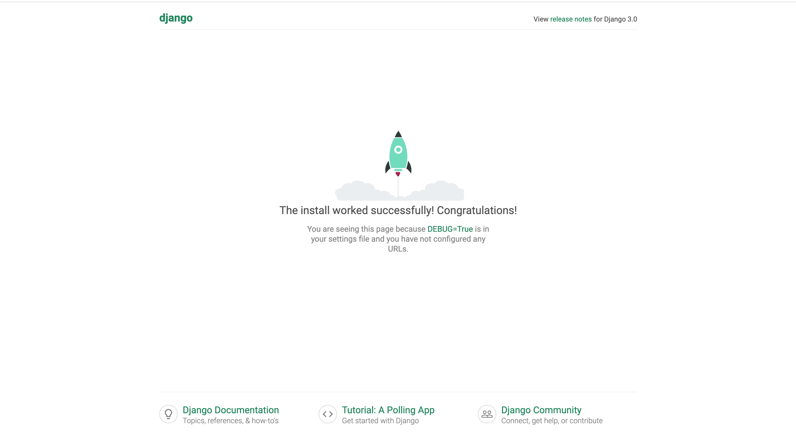

# Python

## [介绍]()

<details>
<summary>展开</summary>

解释型语言

#### Web

- [djang](https://www.djangoproject.com/) : ORM && 模板

- [flask](https://palletsprojects.com/p/flask/) : 轻量

#### Spider

- [Scrapy](https://scrapy.org/F): 官方框架

- [requests](https://github.com/psf/requests): 请求库

- [cheerio](https://github.com/cheeriojs/cheerio): python 版 JQUERY

#### 数据分析

- NumPy: Math 库， `向量` & `矩阵`

- matplotlib: 图形库

#### 深度学习

- Tensorflow: Py2.7

- Pytorch

#### 桌面应用

- PyQT

- wxPython

- Tkinter

#### 哪些企业在使用？

- 豆瓣

- 知乎

- 果壳网

- Instagram

- Quora

- Dropbox

- Reddit

</details>

## [环境]()

<details>
<summary>展开</summary>

地址: https://www.python.org/downloads/

直接下载 `exe`, `dmg` 下载

Mac: `brew install python3`

#### 解释器类型

- CPython： C 语言

- Pypy： Python

- Jython: Java

我们大部分使用的 CPython

#### 依赖管理工具

- pip

- pip3

Mac: `curl https://bootstrap.pypa.io/get-pip.py | python3`

</details>

## [数据结构]()

#### Numbers

<details>
<summary>展开</summary>

```
a = 123
b = 123.1
print(a, b)
```

</details>

#### String

<details>
<summary>展开</summary>

```
a = 'hello'
b = "hello"
c = '''
    hello
    world
    '''
print(a, b, c)
# add
print(a + b)
print(f"{a} {b}")

# slice

print(a[0])
print(a[0:1])
print(a[1:])
print(a[-2:])

# length

print(len(a))

# find

# return 0

print(a.find('h'))

# return 1

print(a.find('y'))

# index

# return 0

print(a.index('h'))

# throw error

try:
print(a.index('y'))
except expression as e:
print(e)

```

</details>

#### List

<details>
<summary>展开</summary>

```

a = [1, 2, 3, 4]
b = [4, 5, 6, 7]

# len

print(len(a))

# max

print(max(a))

# min

print(min(a))

# 合并

print(a+b)

# 插入

a.append(5)

# 查找数目

print(a.count(1))
print(a.count(0))

# insert

a.insert(0, 0)
print(a)

# pop

a.pop()

```

</details>

#### 字典

<details>
<summary>展开</summary>

```

a = {'name': '张三', 'sex': '男'}
print(a)

# get

print(a['name'])

# set

a['age'] = 20
print(a)

# delete attribute

del a['name']
print(a)

# set attr with var

b = 'class'
a[b] = 'map'
print(a)

# len

print(len(a))

# str

print(str(a))

# get keys

print(list(a.keys()))

# get items

print(list(a.items()))

# for in

for name in a:
print(name)
print(a[name])

# check attr

for 'class' not in a:
print('class not in a')
else:
print('class in a')

```

</details>

#### 元组

<details>
<summary>展开</summary>

```

a = (1, 2, 3)
print(a)

print(a[0], a[0:2])

# to list

print(list(a))

# can not change tuple

```

</details>

#### 条件，循环

<details>
<summary>展开</summary>

```

if 0:
print('true')

else:
print('false')

a = 12
while a > 0: # can not use a--/a++
a -= 1
print(a)

a = 123

# 4508868176

print(id(a))
a += 1

# 4508868208 内存地址更改

print(id(a))

```

</details>

#### 函数

<details>
<summary>展开</summary>

```

def fun1(name='lisi'):
print(name)

fun1('张三')
fun1()

# 函数参数

def fun2(func):
func()

fun2(fun1)

# 函数返回

def fun3(a):
def fun4(b):
print(a+b)
return fun4

fun3(1)(2)

```

</details>

#### 模块

<details>
<summary>展开</summary>
pip

> 代理设置

```

cd ~

mkdir .pip && cd .pip && touch pip.conf

cat

[global]
index-url = http://pypi.douban.com/simple
[install]
trusted-host=pypi.douban.com

```

> 远程模块

```

pip3 install requests

pip3 install pyquery

import requests
from pyquery import PyQuery as pq

```

依赖下载地址


依赖全局通用

[pipenv](https://github.com/pypa/pipenv)

> 本地依赖

```

import sys
print(sys.path)
import os

//引用上一级目录模块
path = os.path.abspath('../python_module')
sys.path.append(path)

//引用上级目录模块
from python_module.util.time imoprt getTime

getTime()

```

</details>

#### 面向对象

<details>
<summary>展开</summary>

```

class A(object):
def **init**(self, name):
self.name = name

    def getName(self):
        print(self.name)

a = A('张三')
a.getName()

```

</details>

#### 面向切面

<details>
<summary>展开</summary>

装饰器

```

def time(func):
print(1)

    def decorator(self):
        func(self)
        print(2)
    return decorator

class A(object):
def **init**(self, name):
self.name = name

    @time
    def getName(self):
        print(self.name)

a = A('张三')
a.getName()

```

</details>

#### 多线程

<details>
<summary>展开</summary>

```

import threading
import time

def threadCb(count):
time.sleep(1)
print(count)

# 1234 or 1243

print(1)
threading.Thread(target=threadCb, kwargs={'count': 3}).start()
threading.Thread(target=threadCb, kwargs={'count': 4}).start()
print(2)

```

</details>

#### 异步

<details>
<summary>展开</summary>

```

import asyncio

async def count():
print("One")
await asyncio.sleep(1)
print("Two")

async def main():
await asyncio.gather(count(), count(), count())

asyncio.run(main())

```

</details>

## [Django]()

<details>
<summary>展开</summary>

[地址](https://www.djangoproject.com/)

```

pip install django

django-admin startproject projectname

cd projectname && pipenv install

vi Pipfile

mv

`url = "https://pypi.org/simple"` to `url = "https://pypi.tuna.tsinghua.edu.cn/simple/"`

pipenv shell

python manage.py runserver

```



</details>

## [Flask]()

<details>
<summary>展开</summary>

```

from flask import Flask
app = Flask(**name**)

@app.route('/')
def hello_world():
return 'Hello World!'

if **name** == '**main**':
app.run()

```

</details>

## [Spider]()

<details>
<summary>展开</summary>

```

import requests
from pyquery import PyQuery as pq
from urllib import unquote
import json
import demjson

DEBUG = 1
BASE_URL = 'http://localhost/' if DEBUG == 1 else 'http://localhost:8080/'

const = {
'pc': "Mozilla/5.0 (Macintosh; Intel Mac OS X 10_13_6) AppleWebKit/537.36 (KHTML, like Gecko) Chrome/69.0.3497.81 Safari/537.36",
'mobile': "Mozilla/5.0 (iPhone; CPU iPhone OS 11_0 like Mac OS X) AppleWebKit/604.1.38 (KHTML, like Gecko) Version/11.0 Mobile/15A372 Safari/604.1",
'cookie': 'SUBP=0033WrSXqPxfM72-Ws9jqgMF55529P9D9W5FycSRE0dsqna-s4MW9I8K; SINAGLOBAL=2089896944840.9478.1531718871320; UM_distinctid=164f8784f486e9-0a7fc1fbd28675-163b6952-1aeaa0-164f8784f493c0; SUB=\_2AkMs2y2lf8NxqwJRmP4RxGnkZIt1wgvEieKah9x-JRMxHRl-yj83qhcktRB6B1sDSqj5ArZMf8aiexeau7YZZWuXK0QA; UOR=www.guofenchaxun.com,widget.weibo.com,coolshell.cn; YF-Page-G0=074bd03ae4e08433ef66c71c2777fd84; \_s_tentry=-; Apache=1771134395037.1106.1536384306117; ULV=1536384306170:9:2:3:1771134395037.1106.1536384306117:1535963493335; YF-V5-G0=35ff6d315d1a536c0891f71721feb16e; WBStorage=e8781eb7dee3fd7f|undefined',
}

# 获取网页内容

def run(url):
try:
items = {}
author = {}
detail = getDetail(url)
if(detail):
items = {
'title': detail['page_info']['content2'],
'summary': detail['text'],
'imglink': detail['page_info']['page_pic']['url'],
'videolink': '',
'zan_num': 0,
'comment_num': 0,
'view_num': 0,
'tags': demjson.encode([""]),
'classid': 2,
'status': 1,
'source': url,
'channel': 2,
'tag_str': '',
'relev_id': detail['id'],
'attitudes_count': 0,
'comments_count': detail['comments_count'],
'reposts_count': 0,
}
author = {
'authorid': detail['user']['id'],
'author': detail['user']['screen_name'],
'avatar_url': detail['user']['profile_image_url'],
'homepage': url
}
video = getVideo(url)
if(video):
items['videolink'] = video
insert(items, author)
print(items);
print(author);
except Exception, e:
pass

# 获取详情

def getDetail(url):
try:
url = url.replace('weibo.com/tv/v', 'm.weibo.cn/status')
token = url.split('?')[0].split('status/')[1]
req_url = 'https://m.weibo.cn/statuses/show?id='+token
ret = requests.get(req_url, headers={'user-agent': const['mobile']})
if(ret.status_code == 200):
return demjson.decode(ret.text)['data']
else:
return ''
except Exception, e:
return ''

# 获取视频连接

def getVideo(url):
try:
res = requests.get(
url, headers={'user-agent': const['pc'], 'cookie': const['cookie']})
if(res and res.status_code == 200):
html = pq(res.text)('html')
video = html.find(
'div[node-type="common_video_player"]').attr('video-sources').split('fluency=')[1]
video = unquote(video)
return video
else:
return ''
except Exception, e:
return ''

testurl = 'https://weibo.com/tv/v/GyonPqTS2?fid=1034:4281968821784154'
run(testurl)

```

</details>
